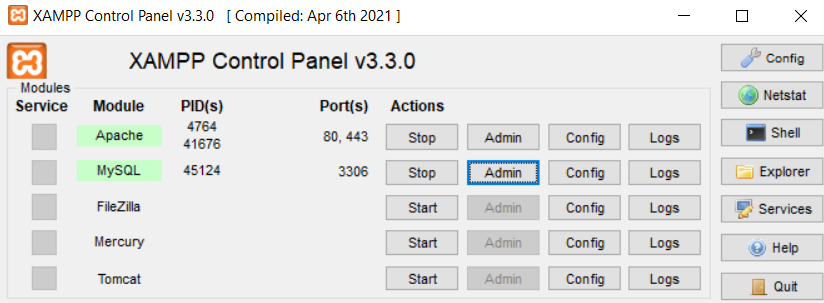

# Desafio full stack STW

Projeto para complementar o processo seletivo com a empresa STW automação.

### 📋 Pré-requisitos

Download do software [Xampp](https://www.apachefriends.org/pt_br/index.html)  
    * MySQL  
    * PHP  
    * Apache  

## 📦 Implantação

    Primeiramente no painel do "Xampp" clickar em "start", tanto no "Apache" quanto no "MySQL".
Então ele irá ficar assim:  

## Clonar todo o repositorio para a seguinte pasta:
        C:\xampp\htdocs

## Criando o banco de dados:

        
        mysql -u root -p
        
        
        create database desafiostw;
        

        mysql -u root -p desafiostw < banco.sql
        

## Considerações finais:
         Uma das principais dificuldades neste projeto, foi fazer a integração do projeto em si, devido a nunca antes ter feito   um projeto integrando front-end, back-end e banco de dados. Com isso em mente, tentei fazer da maneira mais simples   possível, utilizando apenas PHP e MySQL, para pelo menos conseguir entregar um projeto funcional.

         Um ponto técnico específico no qual tive dificuldades, foi na criação das receitas. O fato de ter que fazer uma tabela   relacional, que ligava os ingredientes com a receita foi bem complicado no começo, algumas horas depois de ter   "travado" nesta parte do projeto, as coisas começaram a funcionar novamente.

         Uma dificuldade que eu não consegui resolver nesta versão inicial, muito devido ao pouco tempo que tive para realizar   todo o projeto, foi na tela de criação de receitas. Onde meu objetivo inicial era ter um botão para a função   "Adicionar mais 1 ingrediente a receita". Eu contornei essa dificuldade, mesmo que não tenha ficado da maneira em que   eu planejei inicialmente, fazendo cinco campos para cadastro de ingredientes, onde o usuario tem a opção de relacionar   de 1 ou até 5 ingredientes a uma única receita.

         Alguns pontos de melhoria para as proximas futuras versões, além dos pontos já comentados, é principalmente na parte   visual do projeto, em que não tive muito tempo para dedicar.
